# Rectified Flow
A replication of [Rectified Flow](https://arxiv.org/abs/2209.03003) paper with PyTorch and [U-ViT](https://arxiv.org/pdf/2209.12152.pdf).

  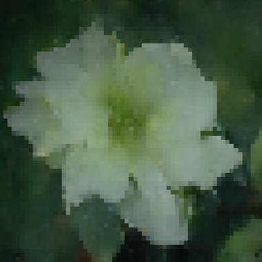
  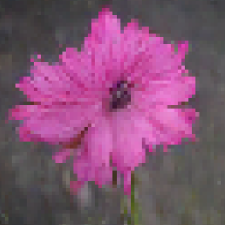 
  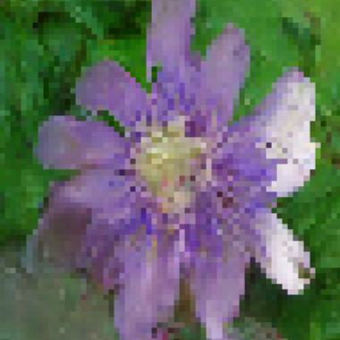
  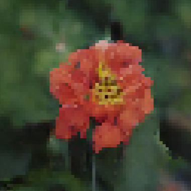

  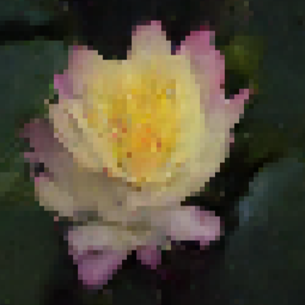
  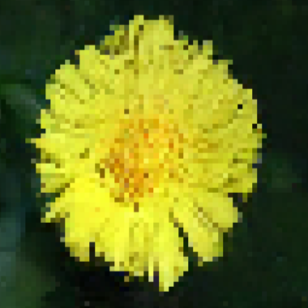 
  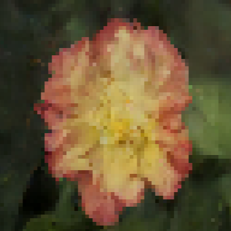
  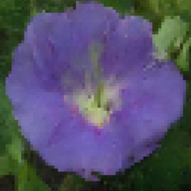

  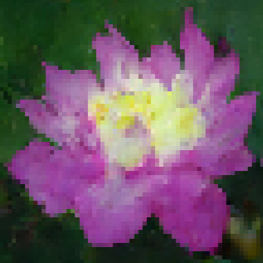
  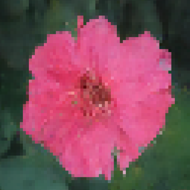 
  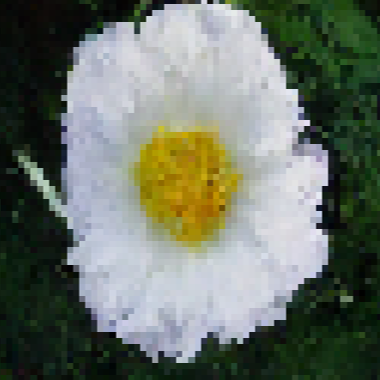
  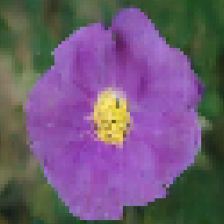

To train a new model, you can modify the yaml file and:

` python multi_gpu_trainer.py example `

Training data of [Oxford Flowers](https://www.robots.ox.ac.uk/~vgg/data/flowers/) should be split manually, and you can find the numpy version of their labels in this repo.

To run inference, please  download my pretrained weight(will be provided later):

` python sample_img.py --device "cuda:0" --load "last" --SavedDir tmp/ --ExpConfig example/example.yaml --n_sqrt 16 --steps 200 `

The inference process is controled by 6 parameters :

"device", usually 'cuda:0' ;

"load", best epoch or last epoch;

"SavedDir", where to save images;

"ExpConfig", the yaml file of your experiments;

"n_sqrt", you will get N2 samples for each class;

"steps", n steps for sampling, in my experiment, 200 is a good choice.

The result should looks like the welcoming images.

Enjoy!

